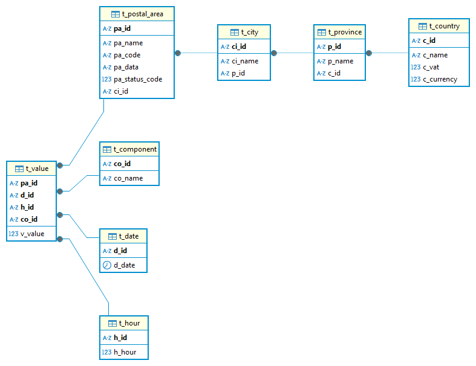

## Electricity-price-analysis

* OBBC: https://learn.microsoft.com/en-us/sql/connect/odbc/download-odbc-driver-for-sql-server?view=sql-server-ver17
* Download data: https://drive.google.com/file/d/1iC9gfp8QR5jIfHB3BdzIk3jx-BzsmfTq/view?usp=sharing

### Run
```bash
docker-compose up -d
```

### 1. Terminal Interfaces
```bash
python data_manager.py
```

### 2. Web Interfaces
* **Database Management:** [http://localhost:8000/public/workbench/](http://localhost:8000/public/workbench/)
* **Bot Management:** [http://localhost:8000/public/bot-panel/](http://localhost:8000/public/bot-panel/)

<!-- ### Database Schema
 -->